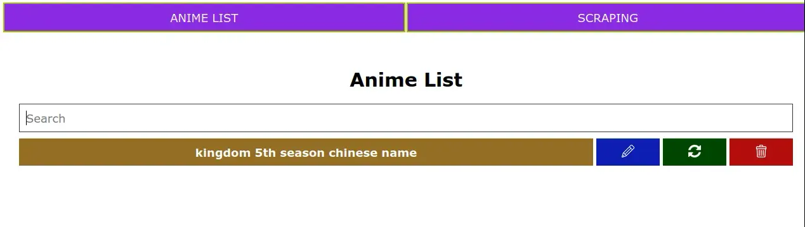
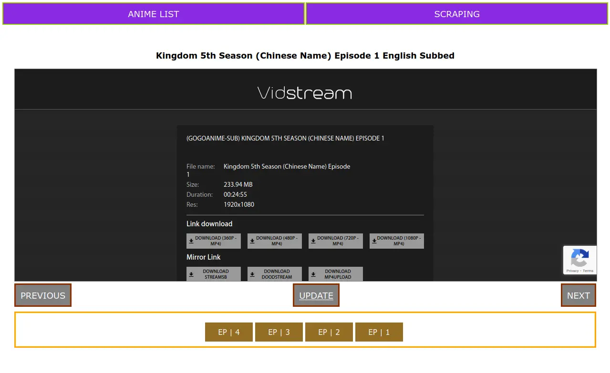
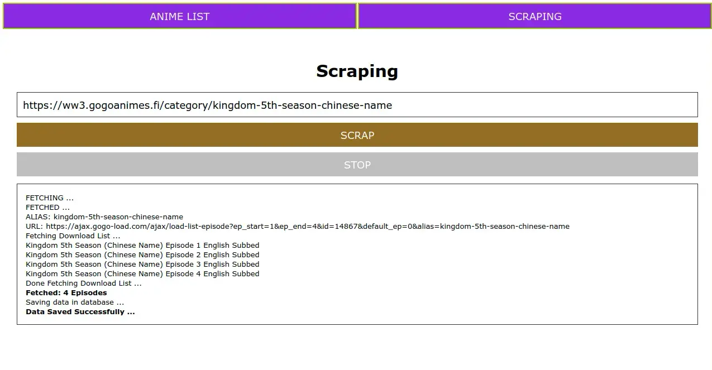

# GoGoAnime Episode Scraper

Web based interface to easily save only download links of specific anime using just link of anime 
It uses GoGo Anime API to fetch link of every episode and then scrap download page link from that URL 
It can store multiple animes which help to easily download episodes 

